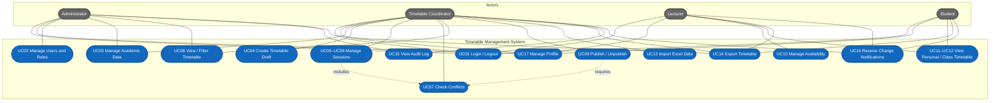

# Detailed Use-Case Diagram

This diagram expands the concise role-to-capability summary in the project README. It shows the individual timetable-management use cases and their relationships.

```mermaid
flowchart TB
    subgraph roles[Actors]
        direction LR
        admin([Administrator])
        coordinator([Timetable Coordinator])
        lecturer([Lecturer])
        student([Student])
    end

    subgraph system[Timetable Management System]
        direction TB
        auth([UC01 Login / Logout])
        profile([UC17 Manage Profile])
        users([UC02 Manage Users and Roles])
        master([UC03 Manage Academic Data])
        draft([UC04 Create Timetable Draft])
        session([UC05–UC06 Manage Sessions])
        conflict([UC07 Check Conflicts])
        timetable([UC08 View / Filter Timetable])
        publish([UC09 Publish / Unpublish])
        availability([UC10 Manage Availability])
        personal([UC11–UC12 View Personal / Class Timetable])
        importData([UC13 Import Excel Data])
        exportData([UC14 Export Timetable])
        audit([UC15 View Audit Log])
        notify([UC16 Receive Change Notifications])
    end

    admin --- auth
    admin --- profile
    admin --- users
    admin --- master
    admin --- timetable
    admin --- audit
    admin --- exportData

    coordinator --- auth
    coordinator --- profile
    coordinator --- master
    coordinator --- draft
    coordinator --- session
    coordinator --- conflict
    coordinator --- timetable
    coordinator --- publish
    coordinator --- importData
    coordinator --- exportData
    coordinator --- audit
    coordinator --- notify

    lecturer --- auth
    lecturer --- profile
    lecturer --- availability
    lecturer --- personal
    lecturer --- exportData
    lecturer --- notify

    student --- auth
    student --- profile
    student --- personal
    student --- exportData
    student --- notify

    session -. includes .-> conflict
    publish -. requires .-> conflict

    classDef actor fill:#666,color:#fff,stroke:#333
    classDef usecase fill:#1168bd,color:#fff,stroke:#0b4f9e
    class admin,coordinator,lecturer,student actor
    class auth,profile,users,master,draft,session,conflict,timetable,publish,availability,personal,importData,exportData,audit,notify usecase
```
